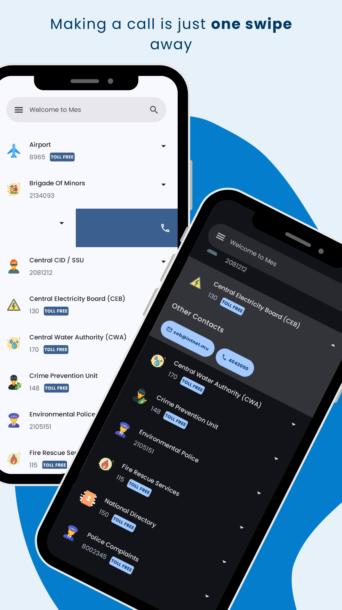
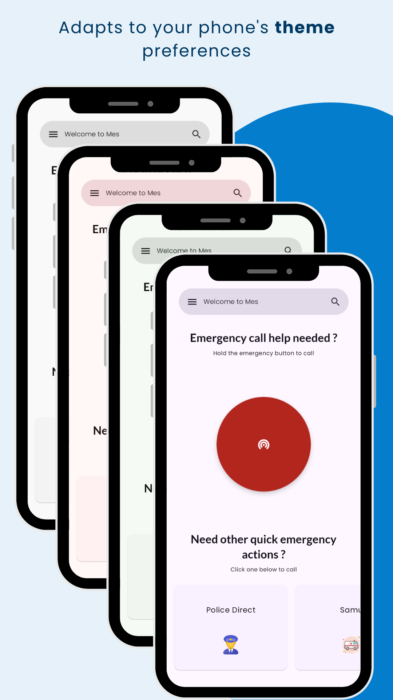

# Mauritius Emergency Services (Mes)

### **Note:** This is an outdated repo. This app has been migrated to Flutter for cross platform deployment. The new flutter repo can be found [here](https://github.com/mervinhemaraju/mauritius-emergency-services). Feel free to look into the previous code to have an idea on how MES started using Android's native Jetpack Compose.


## Table of Contents

- [Introduction](#intro)
- [Official Website](#official_website)
- [Screenshots](#screenshots)
- [Support](#support)
- [Donations](#donations)
- [License](#license)


## Introduction

This is the official Github Repo of [Mes](https://play.google.com/store/apps/details?id=com.th3pl4gu3.mauritius_emergency_services), an emergency calling services app for Mauritius.

Mes is a local app developed by citizen of Mauritius to help people call the right number at the right time, anywhere on the island.
Mes also includes other services contact that could be helpful in certain situations.
It has been designed using the guidelines of Material Design and has been adapted to the new Material You by Android


## Official Website

Mes can be found on its [official website](https://mes.mervinhemaraju.com/web) or via the [playstore](https://play.google.com/store/apps/details?id=com.th3pl4gu3.mauritius_emergency_services)


## Screenshots

    
 


## Support

Reach out to us at the following:

* Website: [mes.mervinhemaraju.com](https://mes.mervinhemaraju.com/web)
* Play Store: [Mes](https://play.google.com/store/apps/details?id=com.th3pl4gu3.mauritius_emergency_services)
* Support Email: th3pl4gu33@gmail.com


## Donations

If you love this project, you can donate in-app or also by Liberapay:

`<noscript><a href="https://liberapay.com/th3pl4gu3/donate">``</a>``</noscript>`

`<sub>`Badge`</sub>`


`<a href="license"></a>`

## License

```
Copyright Mervin Hemaraju
```
